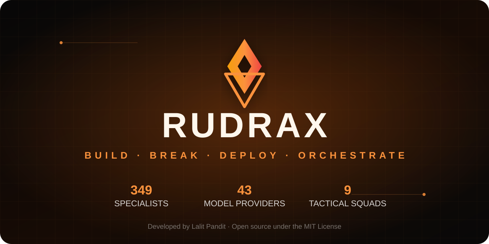

<p align="center">
  
</p>

<p align="center">
  <a href="https://github.com/iamlalitpandit/RudraX/actions/workflows/test.yml"></a>
  <a href="https://github.com/iamlalitpandit/RudraX/actions/workflows/docker-publish.yml"></a>
  <a href="https://github.com/iamlalitpandit/RudraX/releases"></a>
  <a href="LICENSE"></a>
  
  <a href="https://github.com/iamlalitpandit/RudraX/stargazers"></a>
</p>

<p align="center">
  <strong>349 specialist agents. 43 model providers. One command center.</strong>
</p>

<p align="center">
  <a href="https://rudrax.cloud/playground"><strong>Try the live playground</strong></a>
  ·
  <a href="https://rudrax.cloud/autonomous-agents">Browse all agents</a>
  ·
  <a href="https://rudrax.cloud">Documentation</a>
</p>

RudraX Army is an open-source, hierarchical multi-agent runtime for building, testing, deploying, and operating real software. A Chief of Staff breaks down the mission, a Deputy coordinates execution, and specialist agents do the work through tools, quality gates, memory, and tactical squads.

**Project developed by [Lalit Pandit](https://github.com/iamlalitpandit).** Free to use under the MIT License.

> If RudraX saves you time, star the repository. It helps more builders discover the project.

## Why RudraX

| What you get | RudraX |
|---|---|
| Specialist workforce | 349 agents across engineering, security, product, design, finance, legal, healthcare, research, and more |
| Model freedom | 43 provider integrations covering major cloud APIs, Azure AI Foundry, routers, and local inference |
| Tactical execution | 9 ready-made squads for startups, enterprise delivery, security, QA, AI infrastructure, Web3, growth, incidents, and full products |
| Real interfaces | WebUI, terminal UI, CLI, REST API, WebSocket streaming, MCP, and webhooks |
| Local-first operation | Ollama, LM Studio, LocalAI, custom OpenAI-compatible endpoints, and air-gapped deployments |
| Operational controls | Approval gates, sandboxing, PII guardrails, audit logs, cost tracking, scheduling, and observability |
| Persistent intelligence | Cross-session memory, vector knowledge, reflection, knowledge graph, and reusable skills |

## Quick start

```bash
git clone https://github.com/iamlalitpandit/RudraX.git
cd RudraX
npm install
npm run setup       # provider, skills, tools, memory and gateway wizard
npm start
```

The same wizard runs automatically on the first interactive launch. For CI use `npm run setup:defaults`. See [installation setup](docs/installation-setup.md).

Open `http://localhost:5555`.

Default WebUI credentials on a fresh local install are printed in the terminal. Change the password immediately from Settings before exposing the server to a network.

### Run with a local model

```bash
ollama pull llama3.2
ollama serve
npm start
```

RudraX discovers the running Ollama server and its installed models.

### Choose a cloud model

Copy `.env.example`, add only the credentials you use, then list available models:

```bash
cp .env.example .env
rudrax --list-models
rudrax --provider anthropic --model claude-sonnet-4-6
```

RudraX automatically loads environment files in this order: `~/.rudrax/.env`, `~/.rudrax/agent/.env`, then the current project's `.env`. Later files take precedence, variables already exported by the parent process always win, and blank placeholders never erase a configured value. Keep credential files mode `0600`.

You can also configure providers from **WebUI → Settings → Model Provider**. Stored credentials are never returned by the provider API and local credential files use mode `0600`.

## Universal model support

RudraX keeps provider identity, authentication, endpoints, aliases, and representative models in one catalog. It preserves the built-in model registry and adds missing adapters without duplicate provider/model pairs.

| Category | Supported examples |
|---|---|
| Frontier APIs | OpenAI, Anthropic, Google AI Studio, Vertex AI, xAI |
| Enterprise cloud | Azure OpenAI, Azure AI Foundry, AWS Bedrock |
| Routers and inference | OpenRouter, Vercel AI Gateway, Groq, Cerebras, Fireworks, Novita, Together |
| Open-model platforms | DeepSeek, Z.AI/GLM, Kimi, MiniMax, Alibaba, NVIDIA NIM, Hugging Face, StepFun |
| Local and private | Ollama, LM Studio, LocalAI, custom OpenAI-compatible endpoints |

### Azure AI Foundry

```bash
export AZURE_FOUNDRY_ENDPOINT="https://YOUR-RESOURCE.openai.azure.com/openai/v1"
export AZURE_FOUNDRY_DEPLOYMENT="YOUR-DEPLOYMENT"
export AZURE_FOUNDRY_API_KEY="YOUR-KEY"

rudrax --provider azure-foundry --model "$AZURE_FOUNDRY_DEPLOYMENT"
```

RudraX supports both OpenAI-compatible chat and Anthropic-compatible message modes for Foundry endpoints. The OpenAI-compatible adapter sends the Azure `api-key` header without leaking an extra bearer token.

### Custom endpoint

`~/.rudrax/agent/models.json`:

```json
{
  "providers": {
    "custom": {
      "baseUrl": "https://llm.example.com/v1",
      "api": "openai-completions",
      "apiKey": "CUSTOM_API_KEY",
      "models": [{ "id": "my-model", "name": "my-model" }]
    }
  }
}
```

## Command hierarchy

```text
User mission
    │
    ▼
RudraX Chief of Staff
    │  intent, priorities, execution plan
    ▼
Deputy Chief of Staff
    │  decomposition, routing, retries, budgets
    ├───────────────┬───────────────┐
    ▼               ▼               ▼
Specialist       Specialist       Tactical squad
agent A          agent B          (multi-agent)
    └───────────────┴───────────────┘
                    │
                    ▼
          Quality gate and synthesis
                    │
                    ▼
             Verified response
```

## Tactical squads

- **Startup MVP**: product, design, frontend, backend, content
- **Enterprise delivery**: architecture, implementation, security, DevOps, review
- **Security hardening**: threat modeling, audit, remediation, compliance
- **QA and testing**: API tests, performance, evidence, release checks
- **AI infrastructure**: model serving, data pipelines, evaluation, operations
- **Web3**: contracts, security, chain integrations
- **Growth**: content, SEO, analytics, conversion
- **Incident response**: triage, debugging, recovery, reporting
- **Full product**: end-to-end delivery from idea to launch

## Built-in systems

- Hierarchical planning and delegation
- Parallel DAG workflows and agent communication bus
- Persistent memory and vector knowledge base
- Reflection, evaluation, and quality loops
- Tool registry and secure code sandbox
- Approval gates and human-in-the-loop controls
- Cost budgets, tracing, schedules, and webhooks
- Multi-modal input and live streaming WebUI
- JWT authentication and audit trails

## Provider management API

The provider routes use the existing WebUI authentication guard.

```text
GET    /api/providers/catalog
GET    /api/providers/status
PUT    /api/providers/:provider
DELETE /api/providers/:provider
GET    /api/providers/:provider/models
PUT    /api/models/active
```

The implementation rejects command-valued credentials, credential-bearing URLs, metadata-service targets, unsafe cloud host overrides, and prototype-sensitive provider IDs. Multi-file configuration updates use coordinated locks and a recoverable transaction journal.

## Project layout

```text
RudraX/
├── bin/                    CLI launchers
├── lib/core/               runtime, sessions, tools, models, memory
├── lib/core/extensions/    RudraX orchestration system
├── tools/agency/           specialist skills and workflows
├── webui/                  command center and REST/WebSocket server
├── cybersecurity-dashboard/
├── tests/                  unit and integration verification
└── docker/                 container deployment
```

## Contributing

1. Fork the repository.
2. Create a focused branch.
3. Add tests for behavior changes.
4. Run `npm run lint`, `npm test`, and `npm run test:coverage`.
5. Open a pull request with a clear test plan.

Good first contributions include provider adapters, specialist skills, tactical squads, security hardening, documentation, and reproducible examples.

## Security

Do not open public access with the default local credentials. Keep secrets in environment variables or the local credential store, rotate exposed keys, and report vulnerabilities privately using [SECURITY.md](SECURITY.md).

## License and authorship

Copyright © 2026 Lalit Pandit.

RudraX is developed and maintained by **[Lalit Pandit](https://github.com/iamlalitpandit)** and released under the [MIT License](LICENSE). Third-party packages and optional integrations retain their respective licenses; see [third-party notices](THIRD_PARTY_NOTICES.md).

<p align="center">
  <a href="https://rudrax.cloud"><strong>rudrax.cloud</strong></a>
  ·
  <a href="https://rudrax.cloud/playground">Playground</a>
  ·
  <a href="https://github.com/iamlalitpandit/RudraX/issues">Issues</a>
  ·
  <a href="https://github.com/iamlalitpandit/RudraX/discussions">Discussions</a>
</p>
